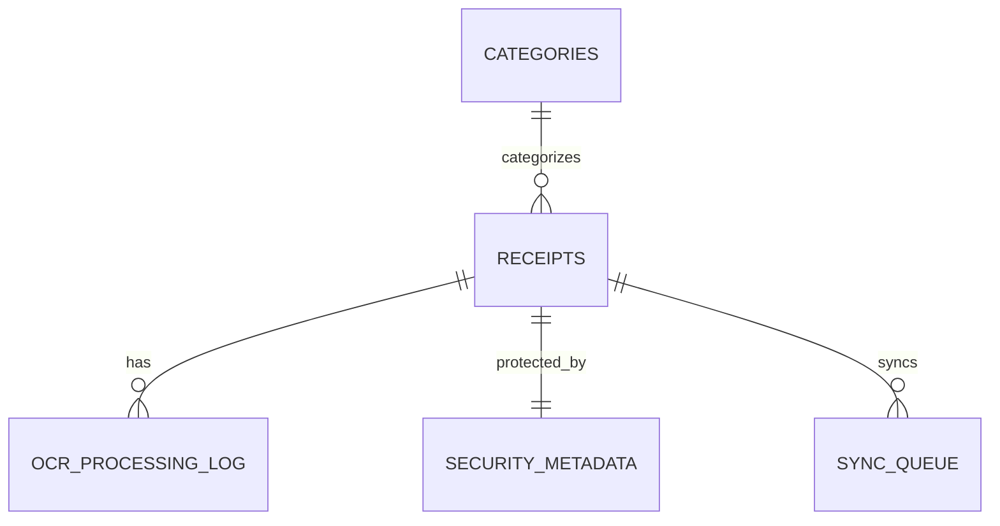

# LLM OCR Database Schema Modification Specification

## Overview

This document outlines the database schema modifications required to support LLM OCR functionality in the Expense Matcher mobile application. The changes include new tables and columns to store enhanced OCR data, security features for sensitive information, performance monitoring capabilities, and migration scripts for seamless upgrades.

## Current Database Schema Analysis

The current SQLite database in the mobile application consists of the following tables:

1. **receipts** - Stores basic receipt information
2. **categories** - Stores expense categories
3. **settings** - Stores application settings
4. **sync_queue** - Manages synchronization between mobile and backend

### Current Receipts Table Structure
```sql
CREATE TABLE IF NOT EXISTS receipts (
  id TEXT PRIMARY KEY,
  merchant TEXT,
  date TEXT,
  amount REAL,
  category TEXT,
  status TEXT,
  imageUri TEXT,
  createdAt TEXT,
  updatedAt TEXT,
  isSynced INTEGER DEFAULT 0,
  syncAction TEXT,
  localPath TEXT
)
```

## Required LLM OCR Data Structures

Based on the backend LLM service implementation, the following data structures are needed:

- merchant (extracted merchant name)
- amount (extracted total amount)
- date (extracted date in YYYY-MM-DD format)
- items (list of items purchased)
- costCodeName (best cost code name for transaction)
- description (detailed description of purchase)
- confidence (confidence score of extraction)
- notes (additional relevant information)
- rawOcrText (original OCR text for reference)

## Proposed Database Schema Modifications

### 1. Enhanced Receipts Table

We'll modify the existing receipts table to accommodate LLM OCR data:

```sql
CREATE TABLE IF NOT EXISTS receipts (
  id TEXT PRIMARY KEY,
  merchant TEXT,
  date TEXT,
  amount REAL,
  category TEXT,
  status TEXT,
  imageUri TEXT,
  createdAt TEXT,
  updatedAt TEXT,
  isSynced INTEGER DEFAULT 0,
  syncAction TEXT,
  localPath TEXT,
  -- LLM OCR specific fields
  costCodeName TEXT,
  description TEXT,
  confidence REAL DEFAULT 0.0,
  notes TEXT,
  rawOcrText TEXT,
  llmProcessed INTEGER DEFAULT 0,
  ocrItems TEXT, -- JSON string of items
  processingTime INTEGER, -- Time taken for OCR processing in milliseconds
  ocrVersion TEXT -- Version of OCR model used
)
```

### 2. OCR Processing Log Table

To track performance and analytics, we'll add a new table:

```sql
CREATE TABLE IF NOT EXISTS ocr_processing_log (
  id TEXT PRIMARY KEY,
  receiptId TEXT,
  processingStartTime TEXT,
  processingEndTime TEXT,
  processingTime INTEGER,
  ocrTextLength INTEGER,
  success INTEGER,
  errorMessage TEXT,
  modelVersion TEXT,
  confidenceScore REAL,
  createdAt TEXT
)
```

### 3. Enhanced Security Table

For encryption and access control:

```sql
CREATE TABLE IF NOT EXISTS security_metadata (
  id TEXT PRIMARY KEY,
  receiptId TEXT,
  encryptionKey TEXT,
  encryptedFields TEXT,
  accessControlList TEXT,
  lastAccessed TEXT,
  accessCount INTEGER DEFAULT 0,
  createdAt TEXT,
  updatedAt TEXT
)
```

## Data Relationship Mappings



## Migration Scripts

### Version 3 Migration (LLM OCR Support)

```javascript
// Migration to version 3
3: async () => {
  console.log('Running migration to version 3 - LLM OCR support');
  
  // Add new columns to receipts table
  await db.executeSql(`
    ALTER TABLE receipts 
    ADD COLUMN costCodeName TEXT
  `);
  
  await db.executeSql(`
    ALTER TABLE receipts 
    ADD COLUMN description TEXT
  `);
  
  await db.executeSql(`
    ALTER TABLE receipts 
    ADD COLUMN confidence REAL DEFAULT 0.0
  `);
  
  await db.executeSql(`
    ALTER TABLE receipts 
    ADD COLUMN notes TEXT
  `);
  
  await db.executeSql(`
    ALTER TABLE receipts 
    ADD COLUMN rawOcrText TEXT
  `);
  
  await db.executeSql(`
    ALTER TABLE receipts 
    ADD COLUMN llmProcessed INTEGER DEFAULT 0
  `);
  
  await db.executeSql(`
    ALTER TABLE receipts 
    ADD COLUMN ocrItems TEXT
  `);
  
  await db.executeSql(`
    ALTER TABLE receipts 
    ADD COLUMN processingTime INTEGER
  `);
  
  await db.executeSql(`
    ALTER TABLE receipts 
    ADD COLUMN ocrVersion TEXT
  `);
  
  // Create OCR processing log table
  await db.executeSql(`
    CREATE TABLE IF NOT EXISTS ocr_processing_log (
      id TEXT PRIMARY KEY,
      receiptId TEXT,
      processingStartTime TEXT,
      processingEndTime TEXT,
      processingTime INTEGER,
      ocrTextLength INTEGER,
      success INTEGER,
      errorMessage TEXT,
      modelVersion TEXT,
      confidenceScore REAL,
      createdAt TEXT
    )
  `);
  
  // Create security metadata table
  await db.executeSql(`
    CREATE TABLE IF NOT EXISTS security_metadata (
      id TEXT PRIMARY KEY,
      receiptId TEXT,
      encryptionKey TEXT,
      encryptedFields TEXT,
      accessControlList TEXT,
      lastAccessed TEXT,
      accessCount INTEGER DEFAULT 0,
      createdAt TEXT,
      updatedAt TEXT
    )
  `);
  
  // Create indexes for performance
  await db.executeSql(`
    CREATE INDEX IF NOT EXISTS idx_receipts_merchant ON receipts(merchant)
  `);
  
  await db.executeSql(`
    CREATE INDEX IF NOT EXISTS idx_receipts_date ON receipts(date)
  `);
  
  await db.executeSql(`
    CREATE INDEX IF NOT EXISTS idx_receipts_confidence ON receipts(confidence)
  `);
  
  await db.executeSql(`
    CREATE INDEX IF NOT EXISTS idx_receipts_llmProcessed ON receipts(llmProcessed)
  `);
  
  await db.executeSql(`
    CREATE INDEX IF NOT EXISTS idx_ocr_log_receiptId ON ocr_processing_log(receiptId)
  `);
  
  await db.executeSql(`
    CREATE INDEX IF NOT EXISTS idx_ocr_log_success ON ocr_processing_log(success)
  `);
  
  await db.executeSql(`
    CREATE INDEX IF NOT EXISTS idx_security_receiptId ON security_metadata(receiptId)
  `);
}
```

## Indexing Strategies

To optimize performance, the following indexes will be created:

1. `idx_receipts_merchant` - For quick merchant lookups
2. `idx_receipts_date` - For date-based queries
3. `idx_receipts_confidence` - For filtering by confidence scores
4. `idx_receipts_llmProcessed` - For identifying LLM-processed receipts
5. `idx_ocr_log_receiptId` - For joining OCR logs with receipts
6. `idx_ocr_log_success` - For filtering successful OCR processes
7. `idx_security_receiptId` - For quick security lookups

## Security Considerations

### Data Encryption
Sensitive fields like `rawOcrText`, `notes`, and `ocrItems` should be encrypted before storage. The `security_metadata` table will store encryption keys and access control information.

### Access Control
The `accessControlList` field in `security_metadata` will define which users or roles can access specific receipt data.

### Data Minimization
Only essential data should be stored locally. Sensitive information should be transmitted to the backend and removed from the device after processing when possible.

## Performance Monitoring and Analytics

The `ocr_processing_log` table will track:
- Processing times for performance analysis
- Success rates for quality assurance
- Model versions for A/B testing
- Confidence scores for accuracy monitoring

## Implementation Plan

1. Update the migration service to include the new version 3 migration
2. Modify the database service to handle new fields
3. Update UI components to display LLM OCR data
4. Implement security measures for sensitive data
5. Add performance monitoring capabilities
6. Test migration with existing data
7. Validate synchronization with backend

## Rollback Plan

If issues are encountered, the migration can be rolled back by:
1. Removing the new columns and tables
2. Reverting to the previous database version
3. Restoring data from backups if necessary

## Testing Strategy

1. Verify migration works with existing data
2. Test new fields are properly saved and retrieved
3. Validate security measures are functioning
4. Confirm performance indexes are effective
5. Ensure synchronization with backend works correctly