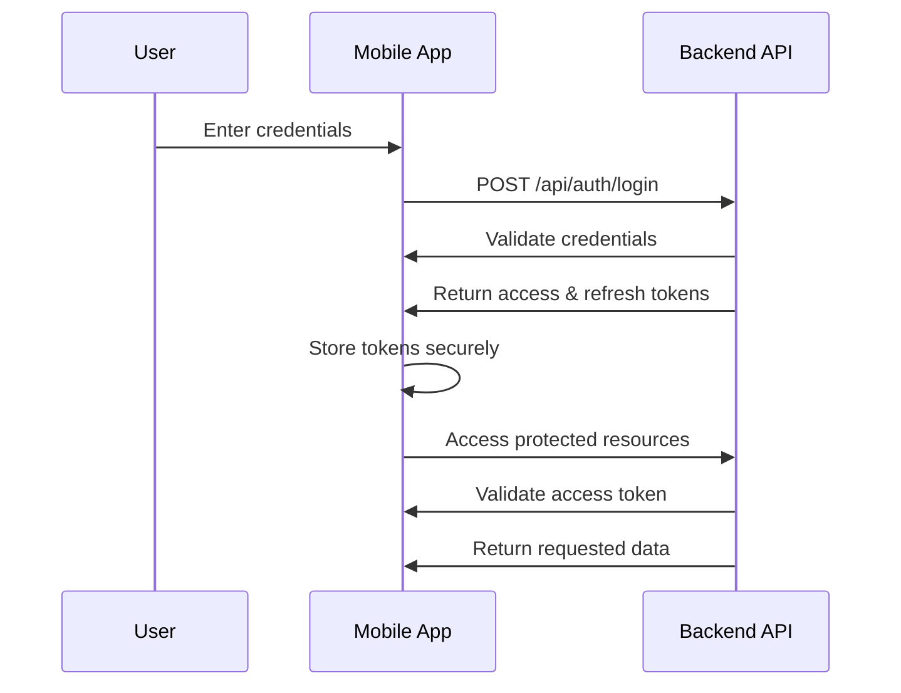
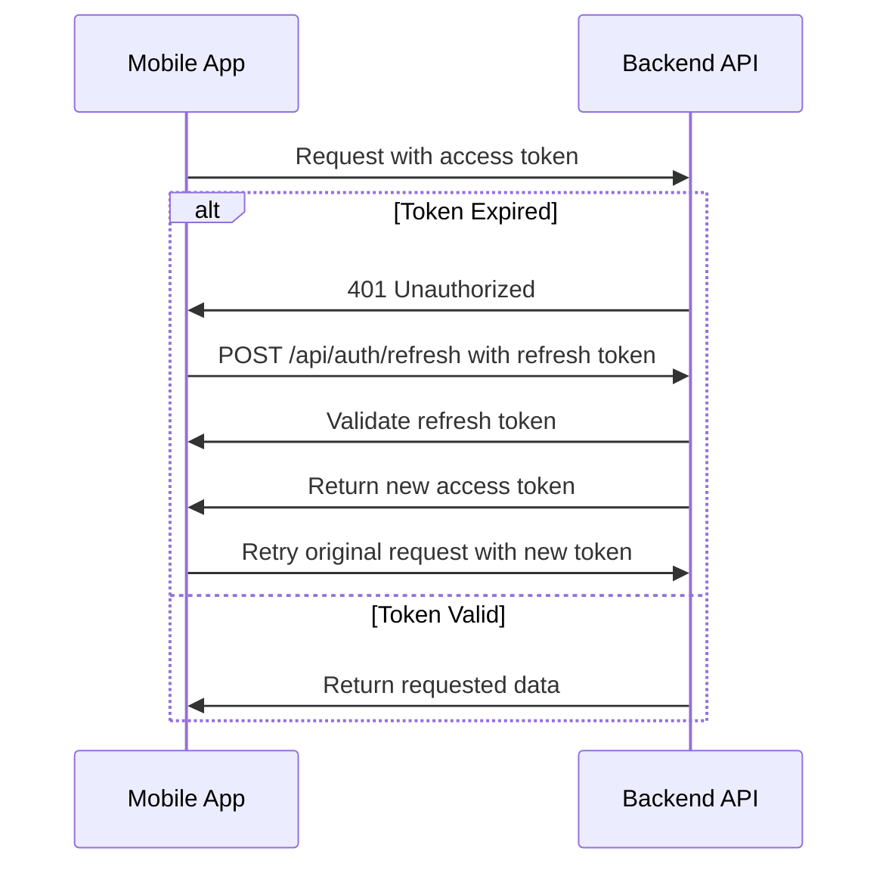
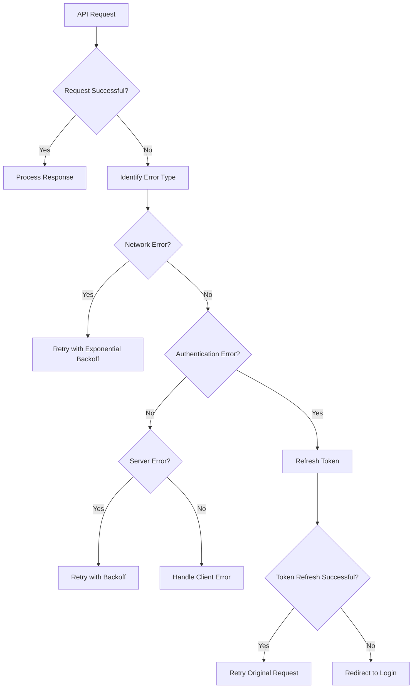
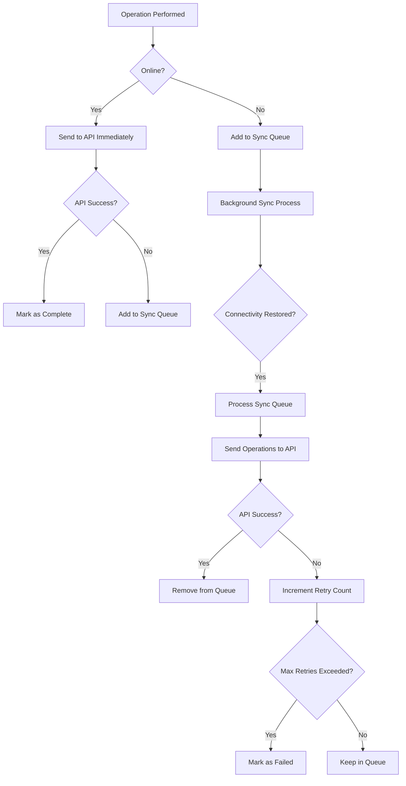

# Secure API Connection Architecture Specification

## 1. Overview

This document outlines the comprehensive technical specification for establishing secure connections between the Expense Matcher mobile application and production backend API endpoints. The architecture includes robust authentication mechanisms, data validation protocols, error handling, offline synchronization strategies, and security measures for data transmission and storage.

## 2. Current Implementation Analysis

### 2.1 Mobile App Authentication
The current mobile app implementation uses a mock authentication system that:
- Stores tokens in AsyncStorage (insecure)
- Does not validate tokens with the backend
- Lacks proper token refresh mechanisms
- Uses mock user data instead of real API calls

### 2.2 Backend Authentication
The backend implements a complete JWT-based authentication system with:
- Secure password hashing using bcrypt
- Access token (15-minute expiration)
- Refresh token (7-day expiration)
- Role-based access control
- Rate limiting for authentication endpoints

### 2.3 Data Synchronization
The mobile app has a synchronization service that:
- Uses a local SQLite database for offline storage
- Implements a sync queue for pending operations
- Has basic conflict resolution strategies
- Lacks proper error handling and retry mechanisms

## 3. Secure API Connection Architecture

### 3.1 API Endpoint Architecture
```
Production API Endpoints:
├── Authentication
│   ├── POST /api/auth/register
│   ├── POST /api/auth/login
│   ├── POST /api/auth/refresh
│   └── POST /api/auth/logout
├── User Management
│   ├── GET /api/auth/profile
│   ├── PUT /api/auth/profile
│   └── PUT /api/auth/password
├── Receipts
│   ├── GET /api/receipts
│   ├── GET /api/receipts/:id
│   ├── POST /api/receipts/upload
│   ├── PUT /api/receipts/:id
│   ├── DELETE /api/receipts/:id
│   ├── GET /api/receipts/:id/view
│   ├── GET /api/receipts/:id/download
│   └── GET /api/receipts/:id/thumbnail
├── Transactions
│   ├── GET /api/transactions
│   ├── GET /api/transactions/:id
│   ├── POST /api/transactions/import
│   ├── PUT /api/transactions/:id
│   └── DELETE /api/transactions/:id
└── Matches
    ├── GET /api/matches
    ├── GET /api/matches/pending
    ├── POST /api/matches/find/:receiptId
    ├── POST /api/matches
    ├── PUT /api/matches/:id/confirm
    ├── PUT /api/matches/:id/reject
    └── DELETE /api/matches/:id
```

### 3.2 Security Patterns
- HTTPS enforcement for all production endpoints
- JWT-based authentication with short-lived access tokens
- Secure refresh token mechanism with rotation
- Role-based access control (RBAC)
- Rate limiting to prevent abuse
- Input validation and sanitization
- Secure headers implementation

## 4. Authentication Mechanisms

### 4.1 JWT Token Handling

#### 4.1.1 Access Token
- **Purpose**: Used for API authentication
- **Expiration**: 15 minutes
- **Storage**: Secure storage (Keychain/Keystore)
- **Transmission**: Authorization header (Bearer token)

#### 4.1.2 Refresh Token
- **Purpose**: Used to obtain new access tokens
- **Expiration**: 7 days
- **Storage**: Secure storage (Keychain/Keystore)
- **Transmission**: Request body for refresh endpoint

### 4.2 Authentication Flow



### 4.3 Token Refresh Strategy



## 5. Data Validation Protocols

### 5.1 Request Validation
- Client-side validation before sending requests
- Backend validation for all incoming data
- Schema validation using JSON Schema or similar
- Sanitization of user inputs

### 5.2 Response Validation
- Validate response structure and data types
- Handle unexpected response formats gracefully
- Implement retry mechanisms for failed validations

### 5.3 Validation Libraries
- **Mobile App**: Joi or Yup for request validation
- **Backend**: Express-validator for request validation

## 6. Error Handling and Retry Mechanisms

### 6.1 Error Categories
1. **Network Errors**: Connection timeouts, DNS failures
2. **Authentication Errors**: Token expiration, invalid credentials
3. **Server Errors**: 5xx responses from backend
4. **Client Errors**: 4xx responses from backend
5. **Validation Errors**: Data format or constraint violations

### 6.2 Retry Strategy
- **Exponential Backoff**: Start with 1s, then 2s, 4s, 8s (max 30s)
- **Maximum Retries**: 3 attempts for most operations
- **Jitter**: Add random delay to prevent thundering herd
- **Circuit Breaker**: Stop retrying after consecutive failures

### 6.3 Error Handling Flow



## 7. Offline-to-Online Synchronization Strategies

### 7.1 Sync Queue Management
- Local SQLite database for offline storage
- Queue-based system for pending operations
- Conflict resolution strategies (timestamp-based)
- Automatic sync when connectivity is restored

### 7.2 Data Models for Sync
```
Sync Queue Table:
- id (INTEGER, PRIMARY KEY)
- tableName (TEXT) - Target table for operation
- recordId (TEXT) - ID of record being synced
- action (TEXT) - create, update, delete
- data (TEXT) - JSON string of operation data
- timestamp (TEXT) - When operation was queued
- retryCount (INTEGER) - Number of retry attempts
- status (TEXT) - pending, in-progress, completed, failed
```

### 7.3 Sync Process Flow



## 8. Security Measures

### 8.1 Data Transmission Security
- **HTTPS Enforcement**: All API calls use HTTPS
- **Certificate Pinning**: Prevent man-in-the-middle attacks
- **Secure Headers**: Implement security headers on backend
- **Content Security Policy**: Restrict resource loading

### 8.2 Data Storage Security
- **Token Storage**: Use Keychain (iOS) / Keystore (Android)
- **Sensitive Data Encryption**: Encrypt locally stored sensitive data
- **Database Encryption**: Use SQLCipher for encrypted SQLite database
- **Secure Deletion**: Properly delete sensitive data when no longer needed

### 8.3 Authentication Security
- **Strong Password Requirements**: Minimum 8 characters, complexity requirements
- **Rate Limiting**: Prevent brute force attacks
- **Token Rotation**: Refresh tokens are rotated on use
- **Token Blacklisting**: Implement token revocation for logout

### 8.4 Network Security
- **Network Monitoring**: Detect suspicious network activity
- **VPN Detection**: Prevent usage with certain VPN configurations
- **Root/Jailbreak Detection**: Prevent usage on compromised devices

## 9. Implementation Recommendations

### 9.1 Mobile App Enhancements
1. Replace mock authentication with real API calls
2. Implement secure token storage using react-native-sensitive-info
3. Add certificate pinning for API connections
4. Implement proper error handling and retry mechanisms
5. Enhance offline sync with conflict resolution

### 9.2 Backend Enhancements
1. Implement certificate pinning validation
2. Add additional security headers
3. Enhance rate limiting with more granular controls
4. Implement audit logging for security events
5. Add multi-factor authentication support

### 9.3 Monitoring and Analytics
1. Implement API usage monitoring
2. Track authentication events
3. Monitor sync operations and failures
4. Log security-related events
5. Set up alerts for suspicious activities

## 10. Integration Strategies

### 10.1 Backend Service Integration
- Use existing Express.js middleware for authentication
- Leverage existing database schema and models
- Integrate with current rate limiting implementation
- Extend existing validation middleware

### 10.2 Mobile App Integration
- Replace mock API service with real implementation
- Integrate with existing SQLite database
- Use existing navigation structure
- Maintain current UI components

## 11. Deployment Considerations

### 11.1 Production Environment
- SSL/TLS certificates for HTTPS
- Load balancer for high availability
- Database backup and recovery procedures
- Monitoring and alerting systems
- Security scanning and penetration testing

### 11.2 Mobile App Distribution
- App store compliance requirements
- Code signing for distribution
- Security review processes
- Update mechanisms for security patches

## 12. Testing Strategy

### 12.1 Security Testing
- Penetration testing of API endpoints
- Authentication flow validation
- Token handling security checks
- Data encryption verification

### 12.2 Integration Testing
- Offline-to-online transition scenarios
- Sync conflict resolution testing
- Error handling and retry mechanism validation
- Performance testing under various network conditions

### 12.3 User Acceptance Testing
- Authentication flow user experience
- Offline functionality validation
- Error message clarity and helpfulness
- Performance under real-world conditions